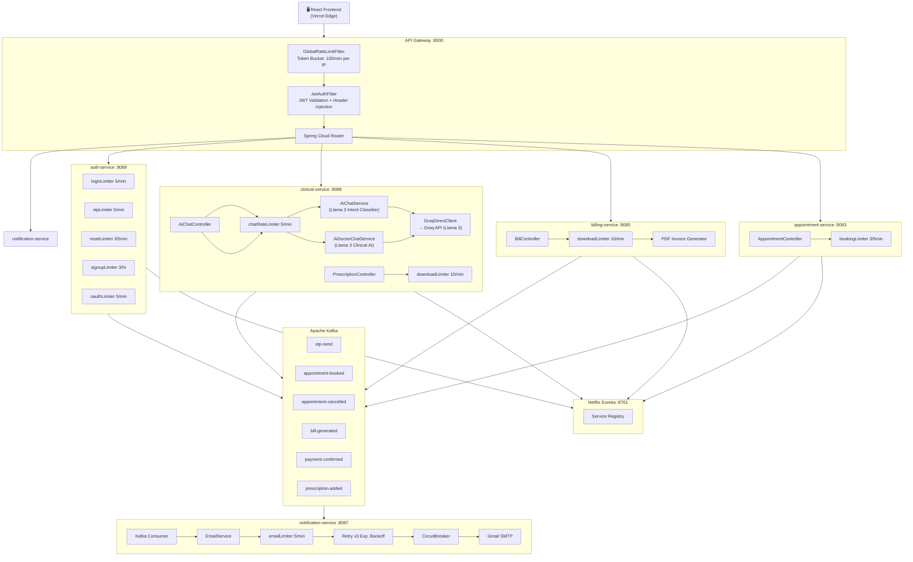

<h1 align="center">🏥 AI-Driven Microservices Hospital Care Platform</h1>

<p align="center">
  
  
  
  
  
  
  
</p>

<p align="center">
  An <strong>enterprise-grade, production-ready hospital management platform</strong> built with Spring Boot Microservices, React 18, Llama 3 AI (Groq), Apache Kafka, and PostgreSQL. Digitizes complete hospital workflows — from patient registration and appointment booking to AI-assisted diagnosis, automated billing, and real-time email notifications.
</p>

<p align="center">
  🌐 <strong>Live Demo:</strong> <a href="https://hospital-management-system.vercel.app">hospital-management-system.vercel.app</a>
</p>

---

## 📋 Table of Contents

1. [Key Highlights](#-key-highlights)
2. [System Architecture](#-system-architecture)
3. [Service Map & Ports](#-service-map--ports)
4. [Complete Architecture Flowchart](#-complete-architecture-flowchart)
5. [Request Lifecycle Flow](#-request-lifecycle-flow)
6. [AI System — Llama 3 + Groq](#-ai-system--llama-3--groq)
7. [Security Architecture](#-security-architecture)
8. [Rate Limiting — Token Bucket (Two Layers)](#-rate-limiting--token-bucket-two-layers)
9. [Event-Driven Architecture (Kafka)](#-event-driven-architecture-kafka)
10. [Email Resilience Strategy](#-email-resilience-strategy)
11. [Database Architecture](#-database-architecture)
12. [Service-by-Service Breakdown](#-service-by-service-breakdown)
13. [Tech Stack](#-tech-stack)
14. [API Reference](#-api-reference)
15. [Getting Started](#-getting-started)
16. [Environment Variables](#-environment-variables)
17. [Deployment Architecture](#-deployment-architecture)

---

## 🌟 Key Highlights

| Feature | Details |
|---|---|
| 🧠 **Dual AI Chatbots** | Patient AI (symptom analysis, booking) + Doctor AI (clinical decision support) powered by **Llama 3 via Groq API** |
| 🔒 **Two-Layer Rate Limiting** | **Token Bucket** at API Gateway (per IP) + per-service (per user/email) — replaced Fixed Window Counter |
| ⚡ **Event-Driven** | Apache Kafka decouples all notification flows — zero latency impact on core operations |
| 📧 **Resilient Email** | `@Async` + `@Retry` (3x exponential backoff) + `@CircuitBreaker` — email service down = hospital keeps running |
| 🔐 **Multi-Auth** | JWT (stateless) + Google OAuth 2.0 + OTP email verification |
| 📄 **PDF Generation** | On-demand Invoice (billing) + Prescription PDF with iText/OpenPDF |
| 🗂️ **Database per Service** | 7 isolated PostgreSQL databases — full data sovereignty |
| ☁️ **Cloud-Native** | Docker Compose locally, AWS EC2 backend, Vercel frontend with edge proxy routing |
| 📊 **Distributed Tracing** | Zipkin integration with 100% sampling for request tracing across services |
| 🌐 **Service Discovery** | Netflix Eureka — no hardcoded IPs, dynamic load balancing |

---

## 🏗 System Architecture

```
                            ┌─────────────────────────────────────────────────┐
                            │              VERCEL EDGE NETWORK                 │
                            │        (Frontend: React 18 + TailwindCSS)        │
                            │   Proxy /api/* → AWS EC2 (solves HTTPS/CORS)    │
                            └───────────────────┬─────────────────────────────┘
                                                │ HTTPS
                                                ▼
                            ┌─────────────────────────────────────────────────┐
                            │                 AWS EC2 Instance                 │
                            │  ┌──────────────────────────────────────────┐   │
                            │  │          API GATEWAY  :8000               │   │
                            │  │  ┌─────────────────────────────────────┐ │   │
                            │  │  │  GlobalRateLimitFilter (order=-1)   │ │   │
                            │  │  │  Token Bucket: 100 req/min per IP   │ │   │
                            │  │  └────────────────┬────────────────────┘ │   │
                            │  │  ┌─────────────────▼────────────────────┐ │   │
                            │  │  │  JwtAuthFilter (order=0)             │ │   │
                            │  │  │  JWT validation + header injection   │ │   │
                            │  │  └────────────────┬────────────────────┘ │   │
                            │  │  ┌─────────────────▼────────────────────┐ │   │
                            │  │  │     Spring Cloud Gateway Router       │ │   │
                            │  │  │  /api/v1/auth/**   → auth-service     │ │   │
                            │  │  │  /api/v1/doctors/** → doctor-service  │ │   │
                            │  │  │  /api/v1/appointments/** → appt-svc   │ │   │
                            │  │  │  /api/v1/patients/** → patient-svc    │ │   │
                            │  │  │  /api/v1/bills/** → billing-service   │ │   │
                            │  │  │  /api/v1/medicines/** → pharmacy-svc  │ │   │
                            │  │  │  /api/v1/prescriptions/** → clinical  │ │   │
                            │  │  │  /api/v1/admin/** → admin-service     │ │   │
                            │  │  └─────────────────────────────────────┘ │   │
                            │  └──────────────────────────────────────────┘   │
                            │                                                   │
                            │  ┌────────┐ ┌──────────┐ ┌──────────────────┐   │
                            │  │ auth   │ │ doctor   │ │  appointment     │   │
                            │  │ :8089  │ │  :8082   │ │    :8083         │   │
                            │  └────────┘ └──────────┘ └──────────────────┘   │
                            │  ┌────────┐ ┌──────────┐ ┌──────────────────┐   │
                            │  │patient │ │ billing  │ │  pharmacy        │   │
                            │  │ :8084  │ │  :8085   │ │    :8086         │   │
                            │  └────────┘ └──────────┘ └──────────────────┘   │
                            │  ┌──────────────┐ ┌────────┐ ┌──────────────┐   │
                            │  │   clinical   │ │ admin  │ │notification  │   │
                            │  │    :8088     │ │ :8081  │ │   :8087      │   │
                            │  └──────────────┘ └────────┘ └──────────────┘   │
                            │                                                   │
                            │  ┌─────────────────────────────────────────┐     │
                            │  │         Apache Kafka + Zookeeper         │     │
                            │  │  Topics: otp-send, appointment-booked,  │     │
                            │  │  appointment-cancelled, bill-generated,  │     │
                            │  │  payment-confirmed, prescription-added  │     │
                            │  └─────────────────────────────────────────┘     │
                            │                                                   │
                            │  ┌─────────────────────────────────────────┐     │
                            │  │   Netflix Eureka Server  :8761           │     │
                            │  │   (Service Registry & Discovery)        │     │
                            │  └─────────────────────────────────────────┘     │
                            └─────────────────────────────────────────────────┘
```

---

## 📡 Service Map & Ports

| Service | Port | Database | Description |
|---|---|---|---|
| **api-gateway** | `8000` | — | Spring Cloud Gateway — single entry point, JWT validation, IP rate limiting |
| **eureka-server** | `8761` | — | Netflix Eureka — service registry & discovery |
| **auth-service** | `8089` | `hms_auth` (PostgreSQL) | JWT auth, OTP, Google OAuth 2.0, user management |
| **doctor-service** | `8082` | `hms_doctor` (PostgreSQL) | Doctor profiles, departments, availability slots |
| **appointment-service** | `8083` | `hms_appointment` (PostgreSQL) | Appointment booking, cancellation, reassignment |
| **patient-service** | `8084` | `hms_patient` (PostgreSQL) | Patient profiles, insurance management |
| **billing-service** | `8085` | `hms_billing` (PostgreSQL) | Invoice generation, payment tracking, PDF export |
| **pharmacy-service** | `8086` | `hms_pharmacy` (PostgreSQL) | Medicine inventory, stock management |
| **notification-service** | `8087` | — (stateless) | Kafka consumer, email dispatch via Gmail SMTP |
| **clinical-service** | `8088` | `hms_clinical` (PostgreSQL) | Prescriptions, medical records, AI chatbots (Llama 3) |
| **admin-service** | `8081` | — (aggregator) | Dashboard stats, admin user management |
| **Kafka** | `9092` | — | Apache Kafka message broker |
| **Kafka UI** | `9090` | — | Web UI to monitor Kafka topics/messages |
| **Zipkin** | `9411` | — | Distributed tracing UI |

---

## 🗺 Complete Architecture Flowchart



---

## 🔄 Request Lifecycle Flow

### Login Flow
```
User submits credentials
        │
        ▼
API Gateway (port 8000)
  ① GlobalRateLimitFilter  → Token Bucket check (100/min per IP)
  ② No JwtAuthFilter       → /auth/** is public
        │
        ▼
auth-service (port 8089)
  ③ loginLimiter.tryAcquire(username)  → Token Bucket (5/min per username)
  ④ Validate credentials against hms_auth DB
  ⑤ Generate JWT (userId + roles)
        │
        ▼
Client receives JWT token
```

### Appointment Booking Flow
```
Patient sends POST /api/v1/appointments
        │
        ▼
API Gateway
  ① GlobalRateLimitFilter (100/min per IP)
  ② JwtAuthFilter → validates JWT → injects X-User-Id, X-User-Roles headers
        │
        ▼
appointment-service
  ③ bookingLimiter.tryAcquire(userId) → Token Bucket (3/5min per patient)
  ④ Validates doctor availability (Feign → doctor-service)
  ⑤ Saves appointment in hms_appointment DB
  ⑥ Publishes "appointment-booked" event to Kafka
        │
        ├──→ Kafka Topic: appointment-booked
        │           │
        │           ▼
        │     notification-service
        │       emailLimiter.tryAcquire(email) → Token Bucket (5/min)
        │       @Retry (3x exponential backoff)
        │       @CircuitBreaker (auto-open if SMTP fails)
        │       Gmail SMTP → patient receives booking confirmation email
        │
        ▼
Patient receives 201 Created response (email sent async, non-blocking)
```

### AI Chat Flow (Patient)
```
Patient sends message: "mujhe bukhar hai, doctor batao"
        │
        ▼
API Gateway → GlobalRateLimitFilter + JwtAuthFilter
        │
        ▼
clinical-service → AiChatController
  ① chatRateLimiter.tryAcquire("patient_<id>") → Token Bucket (5/min)
        │
        ▼
AiChatService
  ② Builds system prompt with patient context (name, ID, current date)
  ③ Calls GroqDirectClient → Groq REST API → Llama 3.x model
  ④ LLM classifies intent as: {"action": "FIND_DOCTORS", "symptomOrKeyword": "fever"}
  ⑤ Executes AiChatTools.getDoctorsBySymptom("fever")
     └─→ Feign call → doctor-service → finds matching specialists
  ⑥ Returns formatted response with doctor list
        │
        ▼
Patient sees: "Here are doctors for fever: Dr. Priya Mehta (General Medicine)..."
```

---

## 🧠 AI System — Llama 3 + Groq

### Overview

The `clinical-service` contains **two AI assistants** powered by **Llama 3** running on **Groq Cloud** (ultra-low latency inference):

| AI | Endpoint | Users | Capability |
|---|---|---|---|
| **Patient AI** (`AiChatService`) | `POST /prescriptions/ai-chat` | Patients | Symptom analysis, doctor search, appointment booking, prescriptions, bills, pharmacy |
| **Doctor AI** (`AiDoctorChatService`) | `POST /prescriptions/ai-chat-doctor` | Doctors | Clinical decision support, drug interactions, treatment suggestions |

### How Intent Classification Works

Instead of relying on Spring AI's tool-calling loop (which had deserialization bugs), a **hybrid intent classification** approach is used:

```
User Message → Groq (Llama 3) → Structured JSON Intent → Java Tool Executor → Real API Call → Formatted Response
```

**Step 1:** LLM classifies message into one of 8 intents:
```json
{
  "action": "FIND_DOCTORS",
  "symptomOrKeyword": "fever",
  "doctorName": null,
  "dateTime": null,
  "reason": null,
  "conversationalReply": null
}
```

**Step 2:** Java switch-case executes the corresponding `AiChatTools` method:

| Intent | Tool Called | What Happens |
|---|---|---|
| `FIND_DOCTORS` | `getDoctorsBySymptom(keyword)` | Feign → doctor-service search |
| `BOOK_APPOINTMENT` | `bookAppointment(patientId, doctor, dateTime, reason)` | Feign → appointment-service POST |
| `GET_PRESCRIPTIONS` | `getMyPrescriptions(patientId)` | Feign → clinical-service DB query |
| `GET_BILLS` | `getMyBills(patientId)` | Feign → billing-service query |
| `SEARCH_MEDICINES` | `getMedicinesBySymptom(keyword)` | Feign → pharmacy-service search |
| `LIST_ALL_DOCTORS` | `getAllDoctorsInHospital()` | Feign → doctor-service list |
| `CHECK_AVAILABILITY` | `getDoctorAvailability(doctorName)` | Feign → doctor-service slots |
| `NONE` | Returns `conversationalReply` | Pure LLM response |

### Supports Hinglish (Hindi + English)
```
"mujhe bukhar hai" → fever → FIND_DOCTORS
"dawai chahiye" → medicine search → SEARCH_MEDICINES
"appointment book karo Dr. Mehta ke saath" → BOOK_APPOINTMENT
```

### Rate Limiting on AI
```java
// Token Bucket: 5 req/min per user (1 token per 12 seconds)
private final RateLimiter chatRateLimiter = new RateLimiter(5, 12000);
```

---

## 🛡 Security Architecture

```
┌─────────────────────────────────────────────────────────────┐
│                     SECURITY LAYERS                          │
│                                                              │
│  Layer 1: RATE LIMITING (API Gateway — GlobalFilter)         │
│  └─→ Token Bucket: 100 req/min per IP                        │
│      Blocks bots before any auth check                       │
│                                                              │
│  Layer 2: JWT VALIDATION (API Gateway — JwtAuthFilter)       │
│  └─→ Validates HMAC-SHA256 signed JWT                        │
│      Injects X-User-Id, X-User-Roles headers                 │
│      Downstream services trust these headers (zero-trust)    │
│                                                              │
│  Layer 3: METHOD-LEVEL SECURITY (@PreAuthorize)              │
│  └─→ @PreAuthorize("hasRole('PATIENT')")                     │
│      Role-based access control (PATIENT/DOCTOR/ADMIN)        │
│                                                              │
│  Layer 4: SERVICE-LEVEL RATE LIMITING (Token Bucket)         │
│  └─→ Per-user/email/IP limits on sensitive endpoints         │
└─────────────────────────────────────────────────────────────┘
```

### Authentication Methods

| Method | Flow | Use Case |
|---|---|---|
| **Email + Password** | `POST /auth/login` → JWT | Standard users |
| **OTP Email Verification** | Signup → OTP via Kafka/Email → Verify | New account activation |
| **Google OAuth 2.0** | Frontend redirect → `GET /auth/oauth2/google/exchange?code=...` → JWT | Social login |

### Roles

| Role | Access |
|---|---|
| `PATIENT` | Own profile, appointments, prescriptions, bills, AI chat |
| `DOCTOR` | Own appointments, create prescriptions, Doctor AI, availability |
| `ADMIN` | Full system access, doctor management, all bills, dashboard |

---

## 🪣 Rate Limiting — Token Bucket (Two Layers)

### Algorithm: Token Bucket
```
Bucket State per key:
  tokens         = current available tokens (starts full)
  lastRefillTime = last calculation timestamp

On each request:
  elapsed        = now - lastRefillTime
  tokensToAdd    = elapsed × refillRatePerMs
  tokens         = min(maxTokens, tokens + tokensToAdd)
  lastRefillTime = now

  if tokens >= 1.0:
      tokens -= 1.0
      return ALLOWED ✅
  else:
      return REJECTED ❌ (429)
```

**Why Token Bucket over Fixed Window Counter?**
```
Fixed Window Problem (old code):
  5 requests at 11:59:59 ✅ + 5 requests at 12:00:00 ✅
  = 10 requests in 2 seconds! Window doesn't catch this. ❌

Token Bucket Solution (new code):
  Tokens refill 1 every 12 seconds continuously
  No matter the timing → burst is absorbed within bucket capacity ✅
  Industry standard: AWS API Gateway, Stripe, Nginx all use this ✅
```

### Layer 1 — API Gateway (Global)

| File | Config | Key | Protects |
|---|---|---|---|
| `GlobalRateLimitFilter.java` | 100 req/min | Client IP | ALL traffic — bots, DDoS, scrapers |

### Layer 2 — Per Service (Fine-Grained)

| Service | Limiter | Endpoint | Config | Key |
|---|---|---|---|---|
| auth | `signupLimiter` | `POST /auth/signup` | **3/hour** | Client IP |
| auth | `loginLimiter` | `POST /auth/login` | 5/min | username |
| auth | `otpLimiter` | `POST /auth/verify-otp` | 5/min | email |
| auth | `otpLimiter` | `POST /auth/resend-otp` | 5/min | email |
| auth | `resetLimiter` | `POST /auth/forgot-password` | 3/5min | email |
| auth | `oauthLimiter` | `GET /auth/oauth2/google/exchange` | 5/min | Client IP |
| appointment | `bookingLimiter` | `POST /appointments` | 3/5min | userId |
| clinical | `chatRateLimiter` | `POST /prescriptions/ai-chat` | 5/min | patient_id |
| clinical | `chatRateLimiter` | `POST /prescriptions/ai-chat-doctor` | 5/min | doctor_id |
| clinical | `downloadLimiter` | `GET /prescriptions/{id}/download` | 10/min | userId |
| billing | `downloadLimiter` | `GET /bills/{id}/download` | 10/min | userId |
| notification | `emailLimiter` | All outgoing emails | 5/min | toEmail |

---

## 📨 Event-Driven Architecture (Kafka)

### Why Kafka?
When a patient books an appointment, we need to send a confirmation email. If the email was synchronous, a slow/down SMTP server would block the booking response. Kafka decouples this completely.

### Kafka Topics & Flow

```
Producer Service          Kafka Topic              Consumer
─────────────────────────────────────────────────────────────
auth-service      ──→  otp-send              ──→  notification-service
auth-service      ──→  doctor-welcome         ──→  notification-service
appointment-svc   ──→  appointment-booked     ──→  notification-service
appointment-svc   ──→  appointment-cancelled  ──→  notification-service
billing-service   ──→  bill-generated         ──→  notification-service
billing-service   ──→  payment-confirmed      ──→  notification-service
clinical-service  ──→  prescription-added     ──→  notification-service
```

### Result
- Patient books appointment → **immediate 201 response** (no email delay)
- Email sent **asynchronously** via notification-service
- If SMTP is down → Circuit Breaker opens → email silently skipped → **booking still works**

---

## 📧 Email Resilience Strategy

notification-service uses **3 resilience layers** stacked on each email send:

```
Request to send email
         │
         ▼
  ① Token Bucket Rate Limiter
     (5 emails/min per recipient)
         │ if allowed
         ▼
  ② @Async — fire-and-forget
     (never blocks the caller)
         │
         ▼
  ③ @Retry — 3 attempts with exponential backoff
     Attempt 1: immediate
     Attempt 2: wait 1s
     Attempt 3: wait 2s
         │ if all 3 fail
         ▼
  ④ @CircuitBreaker (emailCircuitBreaker)
     sliding-window: 5 calls
     failure-threshold: 60%
     if OPEN: skip email silently (fallback method)
     auto-reset after: 30 seconds
         │
         ▼
     Gmail SMTP
```

**Result:** Appointments, bills, prescriptions — everything continues working even if Gmail SMTP is completely down.

---

## 🗃 Database Architecture

Each service has its **own isolated PostgreSQL database** (Database-per-Service pattern):

```
┌─────────────┐  ┌─────────────┐  ┌─────────────┐  ┌─────────────┐
│  hms_auth   │  │ hms_doctor  │  │ hms_patient │  │hms_appointmt│
│  (auth-svc) │  │ (doctor-svc)│  │(patient-svc)│  │  (appt-svc) │
│  ─────────  │  │  ─────────  │  │  ─────────  │  │  ─────────  │
│  users      │  │  doctors    │  │  patients   │  │appointments │
│  roles      │  │  departments│  │  insurance  │  │             │
└─────────────┘  │  availability│  └─────────────┘  └─────────────┘
                 └─────────────┘

┌─────────────┐  ┌─────────────┐  ┌─────────────┐
│hms_clinical │  │hms_pharmacy │  │ hms_billing │
│(clinical-sv)│  │(pharmacy-sv)│  │(billing-svc)│
│  ─────────  │  │  ─────────  │  │  ─────────  │
│prescriptions│  │  medicines  │  │    bills    │
│med_records  │  │  inventory  │  │  payments   │
└─────────────┘  └─────────────┘  └─────────────┘
```

**Benefits:**
- Each service can be scaled independently
- A DB migration in one service never affects others
- Different services can use different DB technologies if needed

---

## 📂 Service-by-Service Breakdown

### 1. 🔐 auth-service `:8089`
**Purpose:** Authentication, authorization, user management

**Key Features:**
- Email + Password login with bcrypt password hashing
- JWT generation (HMAC-SHA256, custom claims: userId, roles)
- OTP email verification on signup (Kafka → notification-service)
- Google OAuth 2.0 — frontend code exchange flow
- Forgot/Reset password with secure token
- Role-based: `PATIENT`, `DOCTOR`, `ADMIN`

**Rate Limiters (Token Bucket):**
- `signupLimiter`: 3/hour per IP
- `loginLimiter`: 5/min per username
- `otpLimiter`: 5/min per email
- `resetLimiter`: 3/5min per email
- `oauthLimiter`: 5/min per IP

---

### 2. 👨‍⚕️ doctor-service `:8082`
**Purpose:** Doctor and department management

**Key Features:**
- Doctor profiles (specialization, bio, fee, photo)
- Department management (Cardiology, Neurology, etc.)
- Availability slots management (working hours, off days)
- Public doctor listing for unauthenticated browsing
- Internal Feign client endpoints for other services

---

### 3. 📅 appointment-service `:8083`
**Purpose:** Appointment lifecycle management

**Key Features:**
- Patient booking with doctor availability validation
- Cancel, Complete, Reassign (ADMIN) operations
- Pagination support for appointment history
- Kafka events on every state change
- Internal slot-query endpoint (used by doctor-service)

**Rate Limiter:** `bookingLimiter` — 3 bookings per 5 minutes per patient

---

### 4. 🧑‍⚕️ patient-service `:8084`
**Purpose:** Patient profile and insurance management

**Key Features:**
- Patient profile (name, DOB, blood group, address)
- Insurance plan management (add/update/delete)
- Patient summary endpoint (used by clinical-service Feign)
- Admin listing of all patients

---

### 5. 💊 pharmacy-service `:8086`
**Purpose:** Medicine inventory management

**Key Features:**
- Medicine catalog (name, description, price, stock)
- Stock deduction on prescription fulfillment
- Low-stock alerts for admins
- Medicine search by name
- AI chat can query pharmacy inventory

---

### 6. 💰 billing-service `:8085`
**Purpose:** Invoice and payment management

**Key Features:**
- Auto-generated invoices on appointment completion (Kafka consumer)
- GST calculation on consultation fees
- Mark-as-paid by admin
- **PDF invoice generation** with formatted layout
- Payment confirmation email via Kafka

**Rate Limiter:** `downloadLimiter` — 10 PDF downloads/min per userId (CPU protection)

---

### 7. 🧠 clinical-service `:8088`
**Purpose:** Medical records, prescriptions, AI chatbots

**Key Features:**
- Prescription creation by doctors (medicines, diagnosis, notes)
- **PDF prescription export**
- Medical record history per patient
- **Patient AI Chatbot** (Llama 3): symptom → doctor search → appointment booking
- **Doctor AI Chatbot** (Llama 3): clinical decision support, drug info
- Pharmacy stock queries through AI
- Prescription email notification via Kafka

**Rate Limiters:**
- `chatRateLimiter`: 5 AI requests/min per user
- `downloadLimiter`: 10 PDF downloads/min per userId

---

### 8. 📧 notification-service `:8087`
**Purpose:** Asynchronous email dispatch

**Key Features:**
- Kafka consumer for all event types
- **Thymeleaf HTML email templates** (styled, branded)
- 7 email types: OTP, appointment booked, cancelled, bill generated, payment confirmed, prescription added, doctor welcome
- `@Async` + `@Retry(3x exponential)` + `@CircuitBreaker`
- **Token Bucket rate limiter**: 5 emails/min per recipient

---

### 9. 🛠 admin-service `:8081`
**Purpose:** Admin dashboard & management

**Key Features:**
- Dashboard stats (Feign aggregation: patients, doctors, appointments, bills)
- Create admin users (internal call to auth-service)
- Manages data across multiple services via Feign clients

---

### 10. 🌐 api-gateway `:8000`
**Purpose:** Single entry point, routing, security

**Key Features:**
- Spring Cloud Gateway (reactive/WebFlux)
- `GlobalRateLimitFilter` — Token Bucket, 100 req/min per IP, order=-1
- `JwtAuthFilter` — JWT validation + header injection (order=0)
- CORS configuration for Vercel frontend
- Route definitions for all 8 microservices
- Distributed tracing with Zipkin

---

## 🛠 Tech Stack

### Backend
| Technology | Version | Purpose |
|---|---|---|
| Java | 21 | Language |
| Spring Boot | 3.3.x | Framework |
| Spring Cloud Gateway | 2023.x | API Gateway (reactive) |
| Spring Security | 6.x | Authentication, authorization |
| Spring Data JPA | 3.x | Database ORM |
| Netflix Eureka | 2023.x | Service registry |
| Apache Kafka | 7.6.0 | Event streaming |
| Resilience4j | 3.x | Circuit breaker, retry |
| OpenFeign | 4.x | Inter-service HTTP client |
| Thymeleaf | 3.x | HTML email templates |
| iText/OpenPDF | — | PDF generation |
| Zipkin | — | Distributed tracing |
| Lombok | — | Boilerplate reduction |

### AI
| Technology | Purpose |
|---|---|
| Groq Cloud API | Ultra-low latency LLM inference |
| Llama 3.x | Intent classification + medical AI |
| Custom GroqDirectClient | Direct REST HTTP client (bypasses Spring AI bugs) |

### Frontend
| Technology | Purpose |
|---|---|
| React 18 | UI framework |
| Vite | Build tool |
| TailwindCSS | Styling |
| Axios | HTTP client |

### Infrastructure
| Technology | Purpose |
|---|---|
| PostgreSQL 16 | Databases (7 isolated instances) |
| Docker + Compose | Containerization |
| AWS EC2 | Backend hosting |
| Vercel | Frontend hosting + edge proxy |

---

## 📖 API Reference

### Auth Service (`/api/v1/auth`)

| Method | Endpoint | Auth | Rate Limit | Description |
|---|---|---|---|---|
| `POST` | `/signup` | ❌ | 3/hr per IP | Register new patient |
| `POST` | `/verify-otp` | ❌ | 5/min per email | Verify OTP |
| `POST` | `/login` | ❌ | 5/min per username | Login, returns JWT |
| `POST` | `/forgot-password` | ❌ | 3/5min per email | Send reset email |
| `POST` | `/reset-password` | ❌ | — | Reset password |
| `POST` | `/resend-otp` | ❌ | 5/min per email | Resend OTP |
| `POST` | `/change-password` | ✅ | — | Authenticated password change |
| `GET` | `/validate` | ✅ | — | JWT validation (used by gateway) |
| `GET` | `/oauth2/google/exchange` | ❌ | 5/min per IP | Google OAuth code exchange |

### Appointment Service (`/api/v1/appointments`)

| Method | Endpoint | Role | Rate Limit | Description |
|---|---|---|---|---|
| `POST` | `/` | PATIENT | 3/5min per userId | Book appointment |
| `PATCH` | `/{id}/cancel` | PATIENT | — | Cancel appointment |
| `PUT/PATCH` | `/{id}/complete` | DOCTOR, ADMIN | — | Mark completed |
| `PATCH` | `/{id}/reassign` | ADMIN | — | Reassign to different doctor |
| `GET` | `/patient` | PATIENT | — | Own appointments (paginated) |
| `GET` | `/doctor` | DOCTOR, ADMIN | — | Doctor's appointments |
| `GET` | `/{id}` | ALL | — | Get by ID |

### Billing Service (`/api/v1/bills`)

| Method | Endpoint | Role | Rate Limit | Description |
|---|---|---|---|---|
| `GET` | `/` | ADMIN | — | All bills |
| `GET` | `/patient` | PATIENT | — | Own bills |
| `GET` | `/{id}` | ALL | — | Get bill by ID |
| `PATCH` | `/{id}/mark-paid` | ADMIN | — | Mark as paid |
| `GET` | `/{id}/download` | PATIENT, ADMIN | 10/min per userId | Download PDF invoice |

### Clinical Service (`/api/v1/prescriptions`)

| Method | Endpoint | Role | Rate Limit | Description |
|---|---|---|---|---|
| `POST` | `/{appointmentId}` | DOCTOR, ADMIN | — | Create prescription |
| `GET` | `/appointment/{appointmentId}` | ALL | — | Get by appointment |
| `GET` | `/my` | PATIENT | — | Own prescriptions |
| `GET` | `/{id}/download` | ALL | 10/min per userId | Download PDF prescription |
| `POST` | `/ai-chat` | PATIENT | 5/min per patientId | Patient AI chatbot |
| `POST` | `/ai-chat-doctor` | DOCTOR | 5/min per doctorId | Doctor AI assistant |

---

## 🚀 Getting Started

### Prerequisites
- Docker & Docker Compose
- Java 21 / Maven 3.9+
- Node.js 18+

### 1. Clone the Repository
```bash
git clone https://github.com/Priyanshujaiswal1024/AI-Microservices-Hospital-Care-Platform.git
cd AI-Microservices-Hospital-Care-Platform
```

### 2. Configure Environment Variables

```bash
cd microservices
cp .env.example .env
# Edit .env with your actual values (see Environment Variables section below)
```

### 3. Start the Backend (Docker Compose)
```bash
cd microservices
docker compose up -d
```

This starts all 11 services + 7 databases + Kafka + Zookeeper + Kafka UI automatically.

**Startup Order (automatic via healthchecks):**
```
Zookeeper → Kafka → Databases → Eureka → All Services → API Gateway
```

### 4. Verify Services Are Running
```bash
# Eureka Dashboard (all services should appear green)
http://localhost:8761

# Kafka UI (monitor topics/messages)
http://localhost:9090

# API Gateway health
http://localhost:8000/actuator/health
```

### 5. Start the Frontend
```bash
cd frontend
npm install
npm run dev
```
Frontend runs at: `http://localhost:5173`

---

## 🔑 Environment Variables

Create `microservices/.env` (see `.env.example`):

```env
# JWT
JWT_SECRET=your-256-bit-secret-key-minimum-32-chars

# Google OAuth 2.0
GOOGLE_CLIENT_ID=your-google-client-id.apps.googleusercontent.com
GOOGLE_CLIENT_SECRET=your-google-client-secret
GOOGLE_REDIRECT_URI=http://localhost:5173/oauth/callback

# Gmail SMTP (notification-service)
MAIL_USERNAME=your-gmail@gmail.com
MAIL_PASSWORD=your-gmail-app-password

# Groq AI (clinical-service)
GROQ_API_KEY=gsk_your-groq-api-key

# Frontend URL (CORS)
FRONTEND_URL=http://localhost:5173

# Eureka (optional override)
EUREKA_USERNAME=admin
EUREKA_PASSWORD=admin
```

---

## ☁️ Deployment Architecture

```
┌────────────────────────────────────────────────────────────┐
│                      PRODUCTION SETUP                       │
│                                                             │
│  ┌─────────────────────────┐   ┌───────────────────────┐   │
│  │      VERCEL EDGE         │   │      AWS EC2           │   │
│  │  ┌───────────────────┐  │   │  ┌─────────────────┐  │   │
│  │  │   React Frontend   │  │   │  │  Docker Compose │  │   │
│  │  │   (Static CDN)     │  │   │  │  All Services   │  │   │
│  │  └────────┬───────────┘  │   │  └────────┬────────┘  │   │
│  │           │               │   │           │            │   │
│  │  ┌────────▼───────────┐  │   │           │            │   │
│  │  │  vercel.json Proxy  │──┼───┼──────────▶│            │   │
│  │  │  /api/* → EC2:8000 │  │   │           │            │   │
│  │  └───────────────────┘  │   │           │            │   │
│  └─────────────────────────┘   └───────────────────────┘   │
│                                                             │
│  Why Vercel Proxy?                                          │
│  • Solves Mixed Content: HTTPS frontend → HTTP backend      │
│  • Solves CORS: Same-origin requests after proxy            │
│  • Zero additional infrastructure cost                      │
└────────────────────────────────────────────────────────────┘
```

---

## 📊 Monitoring & Observability

| Tool | URL | Purpose |
|---|---|---|
| **Eureka Dashboard** | `localhost:8761` | Service health & registration status |
| **Kafka UI** | `localhost:9090` | Topic messages, consumer lag |
| **Zipkin** | `localhost:9411` | Distributed request tracing |
| **Actuator** | `localhost:{port}/actuator/health` | Per-service health (includes Circuit Breaker state) |

---

## 🤝 Contributing

1. Fork the repository
2. Create a feature branch: `git checkout -b feat/your-feature`
3. Commit with conventional commits: `git commit -m "feat(service): description"`
4. Push and open a Pull Request

---

## 📄 License

This project is licensed under the MIT License.

---

<p align="center">Built with ❤️ by <a href="https://github.com/Priyanshujaiswal1024">Priyanshu Jaiswal</a></p>
